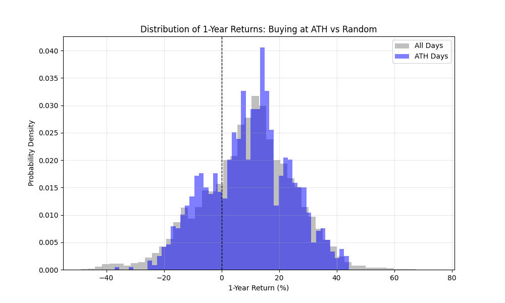

# 📈 S&P 500 Analysis: Buying at All-Time Highs vs. Random

## 🧐 The Hypothesis
There is a common fear in investing: *"I shouldn't buy now, the market is at an All-Time High (ATH). It's sure to crash soon."*

This project uses historical data (1950–Present) to quantitatively test that fear. It compares the 1-year forward returns of two strategies:
1. **The ATH Buyer:** Buys only when the market hits a new highest-ever price.
2. **The Random Buyer:** Buys on any given day regardless of price action.

## 📊 Results Preview
*(Replace this text with your generated image, e.g., )*

> **Key Finding:** Historically, buying at an ATH yielded slightly higher average returns than buying randomly.

## 🛠 Tech Stack
*   **Python 3.x**
*   **Pandas** (Data manipulation, Rolling windows, Expanding max)
*   **Matplotlib** (Data visualization, Histograms)
*   **yfinance** (Data ingestion from Yahoo Finance)

## 📂 Project Structure
```text
├── data/          # Cached CSV data (ignored by git)
├── plots/         # Generated visualizations
├── src/           # Source code
│   ├── analysis.py       # core logic (ATH calc, returns)
│   ├── visualization.py  # plotting functions
│   └── helpers.py        # utility functions
├── main.py        # Entry point
└── requirements.txt
```
## 🚀 How to Run

### 1. Clone the repository
```bash
git clone https://github.com/YOUR_USERNAME/YOUR_REPO_NAME.git
cd YOUR_REPO_NAME
```
### 2. Set up a virtual environment (optional but recommended)
```bash
python -m venv
```

### Activate the virtual environment
Windows:
```bash
.\venv\Scripts\activate
```
macOS / Linux:
```bash
source venv/bin/activate
```

### 3. Install dependencies
```bash
pip install -r requirements.txt
```

### 4. Run the analysis
```bash
python main.py
```

## 📝 Methodology

1. **Data Ingestion**  
   Downloads daily `^GSPC` (S&P 500 Index) data from 1950 to present using `yfinance`.

2. **Feature Engineering**
   - Calculates an **Expanding Maximum** to identify days where the close price equals an all-time high (ATH).
   - Calculates **1-year forward returns** (252 trading days) for every trading day.

3. **Statistical Comparison**  
   Splits the dataset into **ATH Days** and **All Days**, then compares:
   - Mean return
   - Median return
   - Win rate

4. **Visualization**  
   Plots overlapping density histograms to visualize the risk/reward profiles of both strategies.

## ⚖️ Disclaimer

Do your own research. You can lose all your money when investing. This project is for **educational purposes only** and does **not** constitute financial advice. Past performance is not indicative of future results.